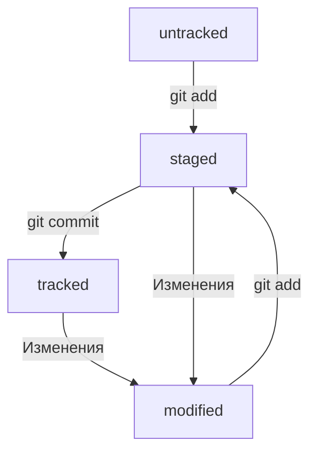

# Description of main commands

* `git init` - инициализируем репозиторий в текущей папке (в которой находимся)
* `git remote -v` (от англ. verbose, «подробный») — проверь, что репозитории действительно связались;
* `git status` - проверяем статус в репозитории (выведет информацию о файлах подлежащих коммиту, измененения и т.д.). А в процессе мержа показывается информацию о конфлитке в файлах
* `git add <file1> [<file2> <file3>]` - "запоминает" изменения в указанных файлах, либо можно указать `.`, чтобы добавить все файлы в папке.
* `git commit` - Фиксирует изменения в репозитории. `-m` - сообщение к коммиту, `--no-edit` - без сообщения, `--amend` - редактирование последнего коммита.
* `git remote add <origin> <'ssh key'>` - устанавливает соединение локального репозитория с удаленным репозиторием. (origin - имя удаленного репозитория)
* `git push` - отправляет изменения в удаленный репозиторий. `-u origin branch` (branch - название ветки) - отправляет изменения в определеннной ветке, нужно прописывать main (master) при первом "пуше" в удаленный репозиторий, который создал сам.
* `git restore <file>` «откатит» изменения в файле до последней сохранённой (в коммите или в staging) версии. `--staged` - переведёт файл из staged обратно в modified или untracked.
* `git reset --hard <commit hash>` - «откатит» историю до коммита с хешем <hash>. Более поздние коммиты потеряются!
* `git log` - полная информация о проделанных коммитах.
* `git diff` - сравнит последнюю закоммиченную версию файла с той, что находится в состоянии modified. `--staged` - покажет изменения в staged-файлах относительно последних закоммиченных версий. `git diff <commit1> <commit2>` - сопоставляет изменения в коммитах.

---
# Hash, logs, status, commits

* Хэш - хранит основную информацию о авторе коммита, дате и содержимого закомиченных файлов. Все хэши хранятся
в папке `.git` репозитория. Преобразуется хэш с помощью алгоритма SHA-1. Увидеть его можно набрав `git log`.

* Можно вызвать не только полный лог, но и сокращённый — это делается командой `git log --oneline`. В сокращённом логе выводятся сокращённые хеши — их можно использовать точно так же, как и полные.
В самом логе содержится: хэш, автор, дата, сообщение коммита.

* *HEAD* (отображается в последнем коммите) - служебный файл папки `.git`. Там лежит ссылка на файл, в котором хранится хэш последего коммита.
Вместо хэша последнего коммита можно писать *HEAD* и Git все поймет.

* Файлы в репозитории имеют 4 статуса: untracked (неотслеживаемый), staged (в списке на коммит), 
tracked (отслеживаемый), modified (измененный).

---
# .gitignore

* Если нужно, чтобы Git игнорировал какие-то файлы, стоит составить файл .gitignore.
* Посмотреть, что игнорируется, можно с помощью команды git status --ignored.
* Сам файл .gitignore — это обычный файл в репозитории. Его тоже стоит закоммитить.
* Существуют шаблоны, которые можно смотреть в интернете.
---
# Работа с ветками
1. Клонирование чужого репозитория
    * `git clone <URL>` (от англ. clone, «клон», «копия») — склонируй репозиторий с URL на мой локальный компьютер.
2. Создание веток
    * `git branch` (от англ. branch, «ветка») — покажи, какие есть ветки в репозитории и в какой из них я нахожусь (текущая ветка будет отмечена символом *);
    * `git branch -a` — покажи все известные ветки, как локальные (в локальном репозитории), так и удалённые (в `origin`, или на GitHub).
    * `git checkout feature/br` — переключись на ветку `feature/br`.
3. Удаление веток
    * `git branch -d br-name` — удали ветку br-name, но только если она является частью main;
    * `git branch -D br-name` — удали ветку br-name, даже если она не объединена с main.
4. Слияние веток
    * `git merge main` (от англ. merge, «сливать», «поглощать») — объедини ветку `main` с текущей активной веткой. 
5. Работа с удалённым репозиторием
    * `git push -u origin my-branch` (от англ. push, «толкнуть», «протолкнуть») — отправь новую ветку my-branch в удалённый репозиторий и свяжи локальную ветку с удалённой, чтобы при дополнительных коммитах можно было писать просто git push без -u;
    * `git push my-branch` — отправь дополнительные изменения в ветку my-branch, которая уже существует в удалённом репозитории;
    * `git pull` (от англ. pull, «вытянуть») — подтяни изменения текущей ветки из удалённого репозитория.
