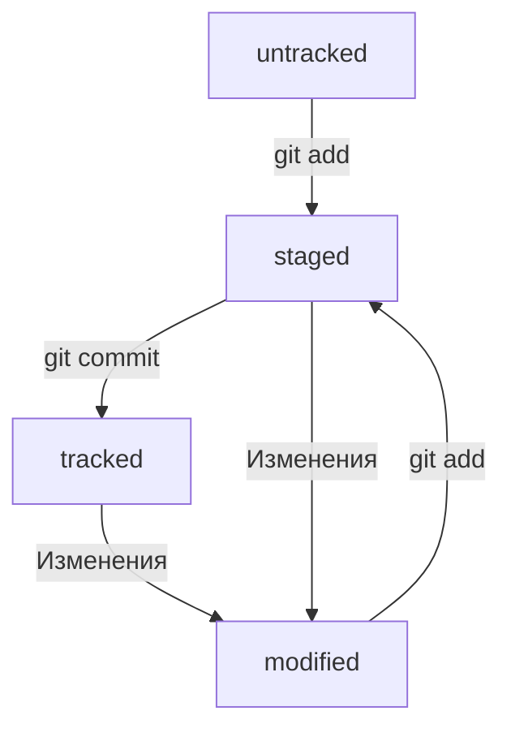

# Description of main commands

* `git init` - инициализируем репозиторий в текущей папке (в которой находимся)
* `git status` - проверяем статус в репозитории (выведет информацию о файлах подлежащих коммиту, измененения и т.д.). А в процессе мержа показывается информацию о конфлитке в файлах
* `git add file1 [file2 file3]` - "запоминает" изменения в указанных файлах, либо можно указать `.`, чтобы добавить все файлы в папке.
* `git commit` - Фиксирует изменения в репозитории. `-m` - сообщение к коммиту, `--no-edit` - без сообщения, `--amend` - редактирование последнего коммита.
* `git remote add origin 'ssh key'` - устанавливает соединение локального репозитория с удаленным репозиторием. (origin - имя удаленного репозитория)
* `git push` - отправляет изменения в удаленный репозиторий. `-u origin branch` (branch - название ветки) - отправляет изменения в определеннной ветке, нужно прописывать main (master) при первом "пуше" в удаленный репозиторий, который создал сам. 
---
# Hash, logs, status, commits

* Хэш - хранит основную информацию о авторе коммита, дате и содержимого закомиченных файлов. Все хэши хранятся
в папке `.git` репозитория. Преобразуется хэш с помощью алгоритма SHA-1. Увидеть его можно набрав `git log`.

* Можно вызвать не только полный лог, но и сокращённый — это делается командой `git log --oneline`. В сокращённом логе выводятся сокращённые хеши — их можно использовать точно так же, как и полные.
В самом логе содержится: хэш, автор, дата, сообщение коммита.

* *HEAD* (отображается в последнем коммите) - служебный файл папки `.git`. Там лежит ссылка на файл, в котором хранится хэш последего коммита.
Вместо хэша последнего коммита можно писать *HEAD* и Git все поймет.

* Файлы в репозитории имеют 4 статуса: untracked (неотслеживаемый), staged (в списке на коммит), 
tracked (отслеживаемый), modified (измененный).

